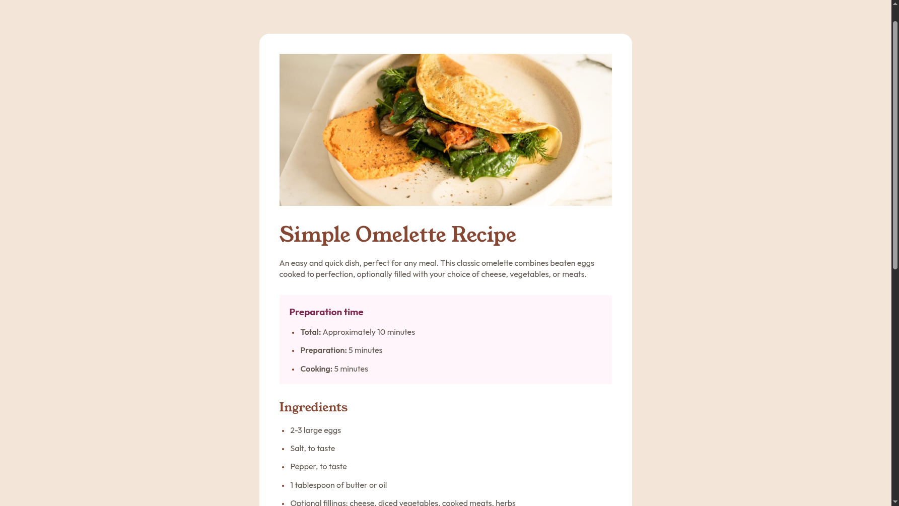

# Frontend Mentor - Recipe page solution

This is a solution to the [Recipe page challenge on Frontend Mentor](https://www.frontendmentor.io/challenges/recipe-page-KiTsR8QQKm). Frontend Mentor challenges help you improve your coding skills by building realistic projects. 

## Table of contents

- [Overview](#overview)
  - [The challenge](#the-challenge)
  - [Screenshot](#screenshot)
  - [Links](#links)
- [My process](#my-process)
  - [Built with](#built-with)
  - [What I learned](#what-i-learned)
  - [Continued development](#continued-development)
  - [Useful resources](#useful-resources)
- [Author](#author)
- [Acknowledgments](#acknowledgments)

## Overview

### Screenshot

### Links

- Solution URL: [solution](https://github.com/ADR-39/recipe-page-main)
- Live Site URL: [live](https://adr-39.github.io/recipe-page-main/)

## My process

### Built with
- vanilla css

### What I learned
- Both `section` and `article` HTML elements are very suitable for (header + paragraph) combination.
  While `section` is more generic, `article` is better for atomic elements.
- You can style the list item indicator (style, size, ...) by styling `li` and its `span` stuff separately.
- To change padding of `li` elements, you'd probably need to use `list-style-position: inside` first.
- Padding does not work with `tr` elements, for that use `th` and `td` instead.
- To add border between table cells, just use `border`.
- Variable fonts `.ttf` files require only one `@font-face` block.

### Continued development
### Useful resources
## Author
## Acknowledgments